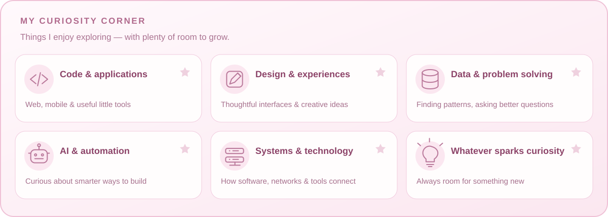
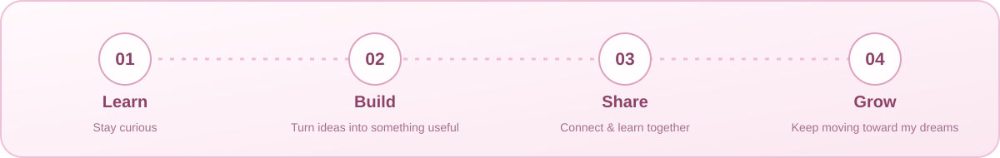

<p align="center">
  
</p>

<p align="center">
  <strong>🌷 Curious about code, creativity & everything tech 🌷</strong><br />
  Learning a little, building a little, dreaming a lot.<br />
  <sub>Tulungagung, Indonesia</sub>
</p>

<p align="center">
  <a href="https://www.linkedin.com/in/kamila-isnaini-2832a2319/"></a>
  <a href="mailto:kamilaisnaini23@gmail.com"></a>
</p>

<p align="center"></p>

## 🌸 A little about me

Hi, I'm **Kamila Isnaini**! Welcome to my little corner of GitHub.

I'm curious about technology and love discovering how things work. From coding and design to data, automation, and ideas I haven't met yet, there's always something new to explore. I enjoy turning ideas into useful experiences and learning through small projects and practice.

I'm excited to keep learning, grow as a developer, and build a successful future — one small step at a time. 🐰

```javascript
const kamila = {
  mindset: "Curious, creative, and always learning",
  exploring: ["Code", "Design", "Data", "AI", "Technology", "New ideas"],
  approach: "Learn → try → build → improve",
  dream: "Grow my skills and create things that make a difference",
  littleJoy: "Pink things, cute bunnies, and tiny breakthroughs 🌷"
};
```

## 🍓 My curiosity corner

<p align="center">
  
</p>

<p align="center"><em>Interests to explore, skills to grow, and lots of little discoveries along the way ♡</em></p>

## 🎀 My toolbox

<p align="center">
  
</p>

<details>
<summary><strong>🍓 Open my full toolkit</strong></summary>

- **Web:** Laravel, PHP, JavaScript (ES6+), HTML5, CSS3, Bootstrap, Tailwind CSS.
- **Mobile:** Kotlin, Android Studio.
- **UI/UX:** Figma, prototyping, responsive design, user flows.
- **Data:** Python, Pandas, NumPy, Matplotlib, SQL, advanced Excel.
- **Databases:** MySQL, SQLite.
- **Tools:** Git, GitHub, VS Code, Cisco Packet Tracer, Google Workspace.

</details>

## 🏅 A little achievement shelf

<p align="center">
  <a href="https://github.com/kamilaisn23?achievement=quickdraw&amp;tab=achievements"></a><br />
  <strong>Quickdraw</strong><br />
  <sub>A small milestone in my GitHub journey.</sub><br />
  <a href="https://github.com/kamilaisn23?tab=achievements">View my GitHub achievements ↗</a>
</p>

## 🐰 My little contribution garden

<p align="center"><strong>Latest · last 12 months</strong></p>

<p align="center">
  
</p>

<p align="center"><a href="https://github.com/kamilaisn23#js-contribution-activity-description">View live contributions on GitHub ↗</a></p>

<p align="center"><strong>🌷 Choose a year</strong></p>

<!-- bunny-years-start -->

<details>
<summary><strong>🎀 2026 · click to view</strong></summary>

<p align="center"></p>

<p align="center"><a href="https://github.com/kamilaisn23?tab=overview&amp;from=2026-01-01&amp;to=2026-12-31">View 2026 on GitHub</a></p>

</details>

<details>
<summary><strong>🎀 2025 · click to view</strong></summary>

<p align="center"></p>

<p align="center"><a href="https://github.com/kamilaisn23?tab=overview&amp;from=2025-01-01&amp;to=2025-12-31">View 2025 on GitHub</a></p>

</details>

<!-- bunny-years-end -->

<p align="center"><em>little hops, little progress, lots of pink ♡</em></p>

## 🎈 Little steps, big dreams

<p align="center">
  
</p>

## 💗 How I work

Problem solving · Project planning · Clear communication · Teamwork · Leadership · Adaptability

<p align="center"></p>

<p align="center">
  <strong>💌 Let's make something lovely and useful</strong><br />
  I'm happy to connect, exchange ideas, and learn together.<br />
  <a href="https://www.linkedin.com/in/kamila-isnaini-2832a2319/">LinkedIn</a> &nbsp;♡&nbsp;
  <a href="mailto:kamilaisnaini23@gmail.com">kamilaisnaini23@gmail.com</a>
</p>

<p align="center"><sub>Thanks for stopping by — may your next little idea become something wonderful 🌸</sub></p>
