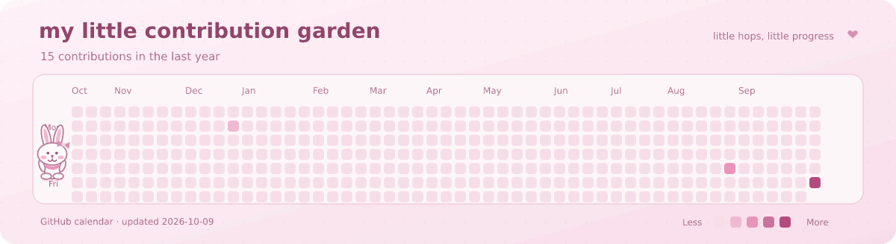

  

  <strong>🌷 Informatics Management Student · Web Development · UI/UX · Data 🌷</strong> 
  Tulungagung, Indonesia

  <a href="https://www.linkedin.com/in/kamila-isnaini-2832a2319/">🎀 LinkedIn</a> &nbsp;♡&nbsp;
  <a href="mailto:kamilaisnaini23@gmail.com">💌 Let's connect</a>

## 🌸 A little about me

Hi, I'm **Kamila Isnaini**! I'm a **D3 Informatics Management student at Politeknik Negeri Malang, PSDKU Kediri**.

I enjoy building practical web applications, designing thoughtful user experiences, and exploring data and applied machine learning. My project and organizational experience includes planning, implementation, teamwork, and technical problem solving.

<em>a little curiosity, a little creativity, and one step at a time ♡</em>

## 🎀 My toolbox

  

<strong>🍓 Open my full toolkit</strong>

- **Web:** Laravel, PHP, JavaScript (ES6+), HTML5, CSS3, Bootstrap, Tailwind CSS.
- **Mobile:** Kotlin, Android Studio.
- **UI/UX:** Figma, prototyping, responsive design, user flows.
- **Data:** Python, Pandas, NumPy, Matplotlib, SQL, advanced Excel.
- **Databases:** MySQL, SQLite.
- **Tools:** Git, GitHub, VS Code, Cisco Packet Tracer, Google Workspace.

## 🌷 My learning journey

**Politeknik Negeri Malang · PSDKU Kediri**  
D3 Manajemen Informatika (Informatics Management)  
**2024–present** · Currently studying

## 🐰 My little contribution garden

  

<em>little hops, little progress, lots of pink ♡</em>

## 💗 How I work

Problem solving · Project planning · Clear communication · Teamwork · Leadership · Adaptability

**Languages:** Indonesian (native) · English (professional working proficiency)

  <strong>💌 Let's make something lovely and useful</strong> 
  For project discussions or professional inquiries: 
  <a href="https://www.linkedin.com/in/kamila-isnaini-2832a2319/">LinkedIn</a> &nbsp;♡&nbsp;
  <a href="mailto:kamilaisnaini23@gmail.com">kamilaisnaini23@gmail.com</a>

Thanks for stopping by my little coding corner 🌸

