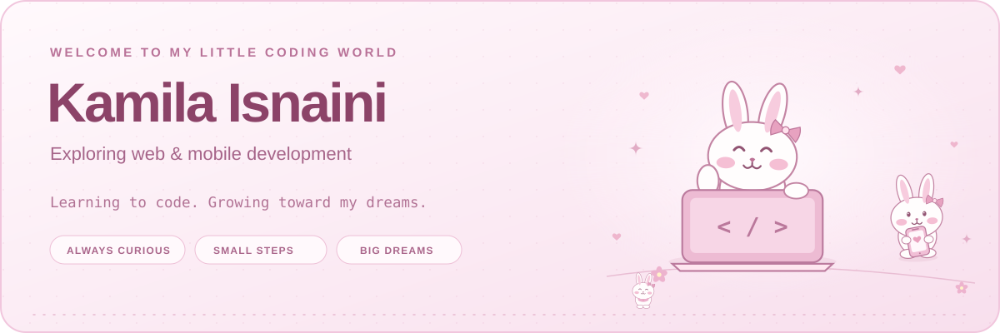

  

  <strong>Informatics Management Student · Web Development · UI/UX · Data</strong> 
  Tulungagung, Indonesia

  <a href="https://www.linkedin.com/in/kamila-isnaini-2832a2319/">LinkedIn</a> &nbsp;·&nbsp;
  <a href="mailto:kamilaisnaini23@gmail.com">Email</a> &nbsp;·&nbsp;
  <a href="#selected-projects">Explore my work</a>

---

## Hello, I'm Kamila

I'm a **D3 Informatics Management student at Politeknik Negeri Malang, PSDKU Kediri**, with project experience in web development, UI/UX design, data integration, and applied machine learning.

I enjoy turning everyday workflows into practical digital tools: designing user flows, building transaction and inventory systems, organizing learning content, and exploring how data can support better decisions. My academic projects and organizational work have given me experience in planning, implementation, teamwork, and technical problem solving.

## Selected projects

### PAK MUALIM · Environmental reporting portal

A Laravel application for SPPG wastewater reporting and monitoring at the Dinas Lingkungan Hidup Kabupaten Tulungagung. The portal brings together operator profiles, daily discharge records, laboratory reports, verification, mapping, and follow-up workflows.

**Focus:** Laravel · Reporting workflows · Role-based access · Data management

### Nescafe Outlet · E-commerce system

**Web Developer · Academic project · 2025**

Developed a Laravel e-commerce platform with end-to-end transaction workflows and real-time inventory management, keeping sales and stock records coordinated.

**Focus:** Laravel · PHP · E-commerce · Inventory management

### GoBeres · Multi-service app prototype

**Project Lead & UI/UX Designer · Academic project · 2025**

Initiated and designed a Figma prototype bringing cleaning, maintenance, and transportation services into one app. Created user flows and navigation to make multiple services easier to discover and use.

**Focus:** Figma · Prototyping · User flows · UI/UX design

### Coffee Roasting Classification · PKM research project

**Machine Learning & Research Developer · Academic project · 2025**

Developed a CNN-based coffee-roasting classification system integrated with capacitive sensor input and fuzzy logic to support analysis across variations in the data.

**Focus:** CNN · Sensor integration · Fuzzy logic · Applied research

<strong>More project experience</strong>

| Project | Role & year | Contribution |
| --- | --- | --- |
| **CDEdu TKA** — digital education for elementary through high school | Content Integration Developer · 2026 | Integrated a large question bank into the application's data structure to support fast, accurate access to learning material. |
| **E-commerce Inventory** | Web Developer · 2025 | Built transaction automation and inventory-management workflows for an academic web-programming project. |
| **Boarding House Management System** | Software Developer · 2025 | Developed a GUI application using data structures to organize, search, and update resident records. |

## Technical toolkit

| Area | Technologies & practices |
| --- | --- |
| **Web development** | Laravel, PHP, JavaScript (ES6+), HTML5, CSS3, Bootstrap, Tailwind CSS |
| **Mobile development** | Kotlin, Android Studio |
| **UI/UX design** | Figma, prototyping, responsive design, user flows |
| **Data & programming** | Python, Pandas, NumPy, Matplotlib, SQL, advanced Excel |
| **Databases** | MySQL, SQLite |
| **Tools** | Git, GitHub, VS Code, Cisco Packet Tracer, Google Workspace |

## Education

**Politeknik Negeri Malang · PSDKU Kediri**  
D3 Manajemen Informatika (Informatics Management) · **2024–present**

## Leadership & organization

**PPI Kabupaten Tulungagung · Youth & Sports Division**  
Committee Chair (Ketua Pelaksana) · Term: **2025–2030**

- Led the digitization of competition registration using a website and Google Forms to improve record keeping and reduce manual data-entry errors.

**D3 Informatics Management Student Gathering**  
Event Committee · **2024**

- Organized the event rundown, designed games and group activities, and coordinated with presenters to support timely delivery.

## Training

| Program | Provider | Completed |
| --- | --- | --- |
| **Python Essentials 1** | Cisco Networking Academy × Python Institute | 29 August 2025 |
| **Introduction to Cybersecurity** | Cisco Networking Academy | 18 June 2025 |

## Working style & languages

**Working style:** problem solving, project planning, clear communication, teamwork, leadership, and adaptability.

**Languages:** Indonesian (native) · English (professional working proficiency)

---

### Let's connect

For project discussions or professional inquiries, reach me on [LinkedIn](https://www.linkedin.com/in/kamila-isnaini-2832a2319/) or at **[kamilaisnaini23@gmail.com](mailto:kamilaisnaini23@gmail.com)**.
