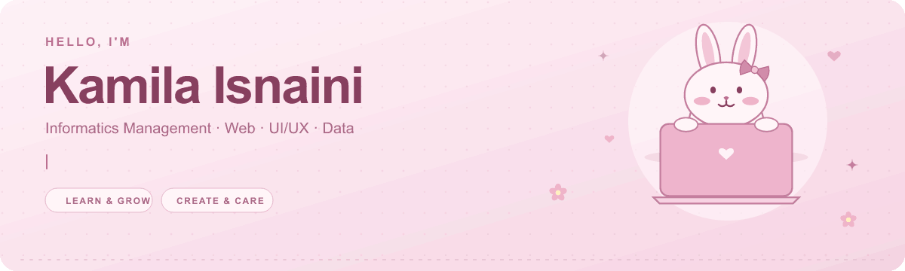
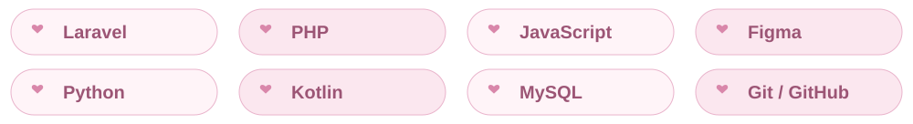

  

  <strong>🌷 Web & Mobile Development · UI/UX · Always Learning 🌷</strong> 
  Tulungagung, Indonesia

  <a href="https://www.linkedin.com/in/kamila-isnaini-2832a2319/">🎀 LinkedIn</a> &nbsp;♡&nbsp;
  <a href="mailto:kamilaisnaini23@gmail.com">💌 Let's connect</a>

## 🌸 A little about me

Hi, I'm **Kamila Isnaini**!

I enjoy building web and mobile applications, designing thoughtful interfaces, and turning ideas into useful experiences. I'm enthusiastic about learning to code, growing my skills, and working toward my dreams — one small step at a time.

<em>a little curiosity, a little creativity, and one step at a time ♡</em>

## 🎀 My toolbox

  

<strong>🍓 Open my full toolkit</strong>

- **Web:** Laravel, PHP, JavaScript (ES6+), HTML5, CSS3, Bootstrap, Tailwind CSS.
- **Mobile:** Kotlin, Android Studio.
- **UI/UX:** Figma, prototyping, responsive design, user flows.
- **Data:** Python, Pandas, NumPy, Matplotlib, SQL, advanced Excel.
- **Databases:** MySQL, SQLite.
- **Tools:** Git, GitHub, VS Code, Cisco Packet Tracer, Google Workspace.

## 🐰 My little contribution garden

<strong>Latest · last 12 months</strong>

  

<a href="https://github.com/kamilaisn23#js-contribution-activity-description">View live contributions on GitHub ↗</a>

<strong>🌷 Choose a year</strong>

<!-- bunny-years-start -->

<strong>🎀 2026 · click to view</strong>

<a href="https://github.com/kamilaisn23?tab=overview&amp;from=2026-01-01&amp;to=2026-12-31">View 2026 on GitHub</a>

<strong>🎀 2025 · click to view</strong>

<a href="https://github.com/kamilaisn23?tab=overview&amp;from=2025-01-01&amp;to=2025-12-31">View 2025 on GitHub</a>

<!-- bunny-years-end -->

<em>little hops, little progress, lots of pink ♡</em>

## 💗 How I work

Problem solving · Project planning · Clear communication · Teamwork · Leadership · Adaptability

  <strong>💌 Let's make something lovely and useful</strong> 
  For project discussions or professional inquiries: 
  <a href="https://www.linkedin.com/in/kamila-isnaini-2832a2319/">LinkedIn</a> &nbsp;♡&nbsp;
  <a href="mailto:kamilaisnaini23@gmail.com">kamilaisnaini23@gmail.com</a>

Thanks for stopping by my little coding corner 🌸

